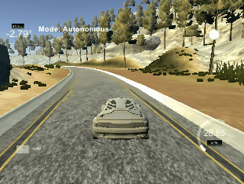
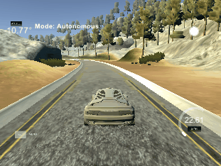
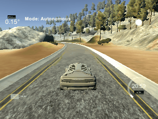

# PID Controller
### Self-Driving Car Engineer Nanodegree - _Term 2, Project 4_
### By: **Soroush Arghavan**
---

_Build instructions are at the bottom of this page_

## Introduction
This project uses a PID controller to steer a simulator around a track autonomously.

To see a video of the vehicle driving a lap around the track autonomously visit the link below:
[Video link](https://youtu.be/rteyqHYAR4Q)

## Reflection
### The effect of the P, I, D component of the PID algorithm in implementation. Is it what you expected?
The P controller determines how agile the controller is to respond to deviation from the set point. The larger the P gain is, the larger the steer value will be. Ideally, a very large P gain is desired for this project. However, by increasing the P gain, the car will overshoot and begin to oscillate out of control. This is expected since the vehicle will begin to deviate further and further from the set point, increasing the steer value each time. This is where the D controller becomes handy.

Kp = 0.2, Ki = 0, Kd = 0;

Kp = 1, Ki = 0, Kd = 0;

The D controller will dampen the amplitude of the oscillatiosn and allow for larger P gains. Again, this is aligned with the expectations since large P gains will cause larger differentials in steer values.

Kp = 0.2, Ki = 0, Kd = 2;

The I controller ensures that the vehicles remains close to the center of the track as even the slightest deviations will build up to a large steer value. However, since the simulator does not have any "friction" or dissipation of energy, even a small value of I gain will result in a slight oscillation about the set point (center of the track). This is not surprising since the I controller is usually used to overcome physical imperfections such as friction or bias.

## Dependencies

* cmake >= 3.5
 * All OSes: [click here for installation instructions](https://cmake.org/install/)
* make >= 4.1
  * Linux: make is installed by default on most Linux distros
  * Mac: [install Xcode command line tools to get make](https://developer.apple.com/xcode/features/)
  * Windows: [Click here for installation instructions](http://gnuwin32.sourceforge.net/packages/make.htm)
* gcc/g++ >= 5.4
  * Linux: gcc / g++ is installed by default on most Linux distros
  * Mac: same deal as make - [install Xcode command line tools]((https://developer.apple.com/xcode/features/)
  * Windows: recommend using [MinGW](http://www.mingw.org/)
* [uWebSockets](https://github.com/uWebSockets/uWebSockets)
  * Run either `./install-mac.sh` or `./install-ubuntu.sh`.

* Simulator. You can download these from the [project intro page](https://github.com/udacity/self-driving-car-sim/releases) in the classroom.

There's an experimental patch for windows in this [PR](https://github.com/udacity/CarND-PID-Control-Project/pull/3)

## Basic Build Instructions

1. Clone this repo.
2. Make a build directory: `mkdir build && cd build`
3. Compile: `cmake .. && make`
4. Run it: `./pid`. 

